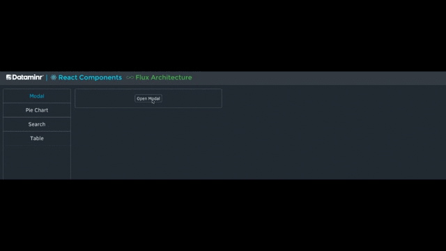

# Modal Component



### Usage

```
title
    type: string
    required: false
    description: The text that will be displayed as the modal header
    
closeModalCallback
    type: function
    required: false
    description: Triggered when the modal is closed by clicking on the close button or pressing escape
        
iconClasses
    type: object
    required: false
    default: {
        close: 'fa fa-close'
    }
    description: Used to override default icons
```

#### Example Usage

```javascript
var Modal = require('drc/modal/Modal');
var PortalMixins = require('drc/mixins/PortalMixins');

return React.createClass({
    displayName: 'App',
    mixins: [PortalMixins],
    // ...
    
    render: function() {
        // ...
        <input type="button" className="modal-button" onClick={this.openModal} value="Open Modal" />
        // ...
        
    }
    
    openModal: function() {
        this.openPortal(
            <Modal title="Modal Title" closeModalCallback={this.closePortal}>
                Paleo hella meditation Thundercats. Artisan Wes Anderson plaid, meggings trust fund sartorial
                slow-carb flexitarian direct trade skateboard. Gentrify sriracha Kickstarter Godard butcher
                McSweeneys. Etsy keffiyeh hoodie irony vinyl. Ugh VHS hella, mlkshk craft beer meh banh mi.
                Whatever normcore Truffaut sustainable lo-fi literally, Vice leggings XOXO. Wayfarers Austin
                tattooed mlkshk asymmetrical plaid butcher, chia stumptown post-ironic.
            </Modal>
        );
    }
}
```
