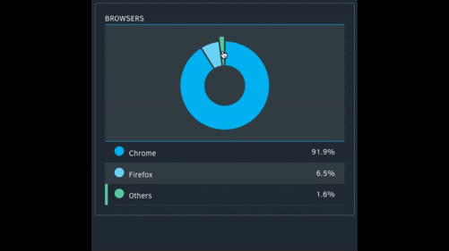

# Pie Chart Component



### Usage

```
componentId
    type: string
    required: true
    description: Used by the PieChartStore to keep track of PieChart state
    
key
    type: string
    required: true
    description: Used by React when there are more than one pie chart displayed consecutively by a component
    
definition
    type: object
    required: true
    definition: This defines the look, feel, and display of the pie chart
    
    url
        type: string
        required: true
        description: The endpoint for requesting data
        
    label
        type: string
        required: true
        description: The textual description of what the data is representative of
        
colors
    type: array
    required: false
    default: [
        '#00B0F1', //dark blue
        '#6DD2F7', //light blue
        '#58C99E', //light green
        '#11B275', //dark green
        '#53959C', //slate
        '#545F88', //lavender
        '#6E4A99', //grape
        '#D35E5E', //pink
        '#E4C000', //yellow
        '#F37E1C', //orange
        '#ECECEC', //off-white
        '#BC0C0C'  //red
    ]
    description: The colors in priority order that will be used in the display of the pie chart
        
filters
    type: object
    required: false
    description: Sent as data with requests to the server
    
loadingIconClasses
    type: array|string
    required: false
    default: 'icon ion-loading-c'
    description: Used to override the loading icon
```

### Example Usage

```javascript
var pieChartDefinition = {
    url: '/test/piechart',
    label: 'BROWSERS'
};
```

```javascript
<PieChart definition={pieChartDefinition}
                      componentId={'pieChartId'}
                      key={'pieChartId'}
                      loadingIconClasses={['icon', 'ion-loading-c']} />
```

### Example Data

```javascript
var pieChartData = [
    {"name": "Chrome", "value": 2090, "children": [
            {"name": 38, "value": 1933, "percent": 92.5},
            {"name": "Others", "value": 157, "percent": 7.5, "children": [
                {"name": 37, "value": 41, "percent": 26.1},
                {"name": 40, "value": 26, "percent": 16.6},
                {"name": 33, "value": 24, "percent": 15.3},
                {"name": 35, "value": 20, "percent": 12.7},
                {"name": 39, "value": 18, "percent": 11.5},
                {"name": 36, "value": 12, "percent": 7.6},
                {"name": 21, "value": 4, "percent": 2.5},
                {"name": 32, "value": 4, "percent": 2.5},
                {"name": 29, "value": 4, "percent": 2.5},
                {"name": 34, "value": 3, "percent": 1.9},
                {"name": 28, "value": 1, "percent": 0.6}
            ]}
        ], "percent": 91.9},
    {"name": "Firefox", "value": 147, "children": [
        {"name": 33, "value": 77, "percent": 52.4},
        {"name": 32, "value": 30, "percent": 20.4},
        {"name": 31, "value": 23, "percent": 15.6},
        {"name": 27, "value": 8, "percent": 5.4},
        {"name": "Others", "value": 9, "percent": 6.2, "children": [
            {"name": 30, "value": 3, "percent": 33.3},
            {"name": 28, "value": 2, "percent": 22.2},
            {"name": 24, "value": 2, "percent": 22.2},
            {"name": 20, "value": 1, "percent": 11.1},
            {"name": 34, "value": 1, "percent": 11.1}
        ]}
    ], "percent": 6.5},
    {"name": "Others", "value": 36, "percent": 1.6, "children": [
        {"name": "IE", "value": 14, "children": [
            {"name": 10, "value": 9, "percent": 64.3},
            {"name": 11, "value": 5, "percent": 35.7}
        ], "percent": 38.9},
        {"name": "Chromium", "value": 8, "children": [
            {"name": 37, "value": 8, "percent": 100}
        ], "percent": 22.2},
        {"name": "Safari", "value": 12, "children": [
            {"name": 8, "value": 6, "percent": 50},
            {"name": 7, "value": 5, "percent": 41.7},
            {"name": 192, "value": 1, "percent": 8.3}
        ], "percent": 33.3},
        {"name": "Mobile Safari", "value": 2, "children": [
            {"name": 8, "value": 1, "percent": 50},
            {"name": 7, "value": 1, "percent": 50}
        ], "percent": 5.6}
    ]}
];
```
